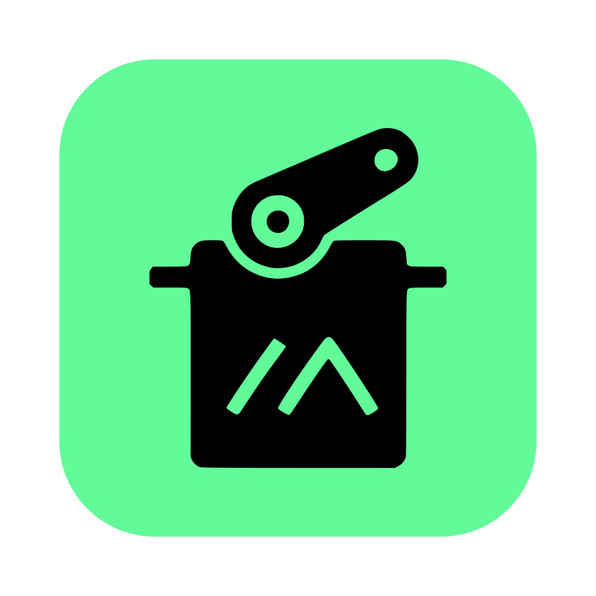

  

<h1 align="center">Meshtastic Android with servo support</h1>

This is a fork of the official Meshtastic Android app, adding support for configuration settings exposed by [my fork](https://github.com/mehow/meshtastic-firmware) of Meshtastic firmware.

## Get Started

Use Android Studio to build the app and install it on your phone.

Then go to Module Configuration where you'll find a new Servo Control option.

Note: at the moment this fork does not provide a separate UI to control the servo.
Use text messages to control it as described in the firmware repository.